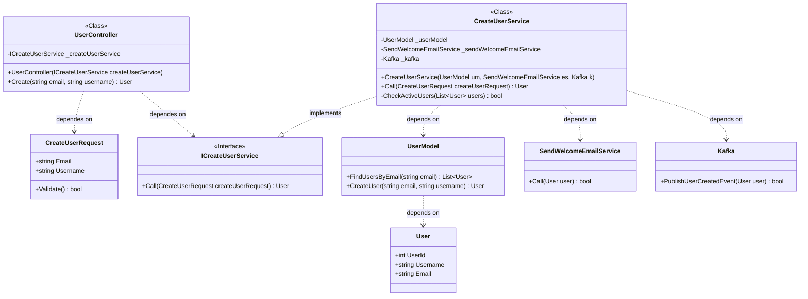

```mermaid
classDiagram
    class UserController {
        <<Class>>
        -ICreateUserService _createUserService
        +UserController(ICreateUserService createUserService)
        +Create(string email, string username) User
    }

    class ICreateUserService {
        <<Interface>>
        +Call(CreateUserRequest createUserRequest) User
    }

    class CreateUserRequest {
        +string Email
        +string Username
        +Validate() bool
    }

    class CreateUserService {
        <<Class>>
        -UserModel _userModel
        -SendWelcomeEmailService _sendWelcomeEmailService
        -Kafka _kafka
        +CreateUserService(UserModel um, SendWelcomeEmailService es, Kafka k)
        +Call(CreateUserRequest createUserRequest) User
        -CheckActiveUsers(List~User~ users) bool
    }

    class UserModel {
        +FindUsersByEmail(string email) List~User~
        +CreateUser(string email, string username) User
    }

    class User {
        +int UserId
        +string Username
        +string Email
    }

    class SendWelcomeEmailService {
        +Call(User user) bool
    }

    class Kafka {
        +PublishUserCreatedEvent(User user) bool
    }

    UserController ..> CreateUserRequest: dependes on
    UserController ..> ICreateUserService: dependes on
    CreateUserService ..|> ICreateUserService: implements
    CreateUserService ..> UserModel: depends on
    UserModel ..> User: depends on
    CreateUserService ..> SendWelcomeEmailService: depends on
    CreateUserService ..> Kafka: depends on
```
